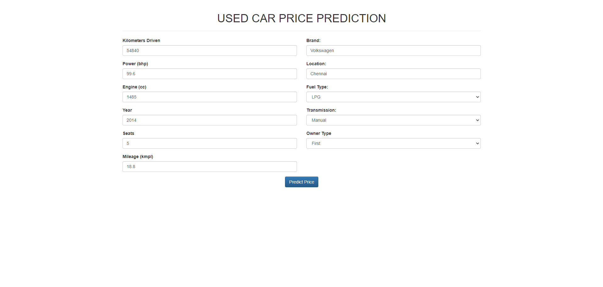
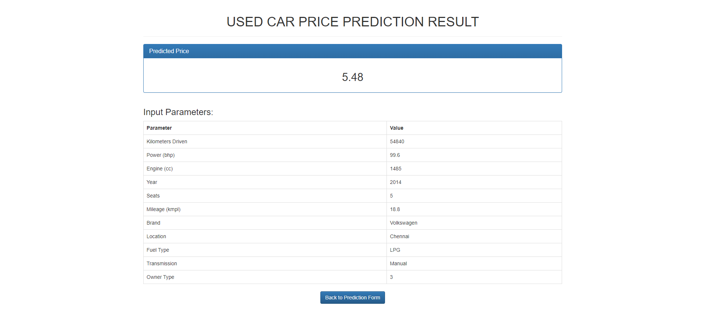
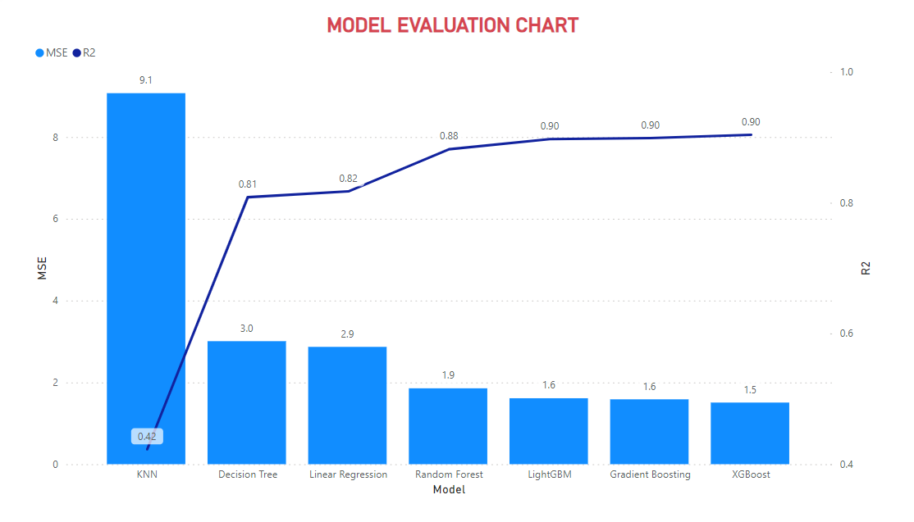

# Used Car Price Prediction App
## Introduction
Welcome to the Used Car Price Prediction App! This user-friendly web application is designed to help both buyers and sellers in the used car market. By leveraging machine learning algorithms, our app predicts the fair market price of a used car based on various input parameters provided by the user.





| Parameter | Description |
|-----------|-------------|
| Kilometers_Driven | Total kilometers driven by the car |
| Power | Engine power in BHP (Brake Horsepower) |
| Engine | Engine capacity in cc |
| Seats | Number of seats in the car |
| Mileage | Fuel efficiency in km/l|
| Year | Year of manufacture |
| Location | City where the car is being sold |
| Fuel_Type | Type of fuel (e.g., Petrol, Diesel, CNG) |
| Transmission | Transmission type (e.g., Manual, Automatic) |
| Brand | Car manufacturer |
| Owner_Type | Number of previous owners |

**Note: Age is calculated as (2019 - Year of manufacture)**

## How to use?
Install required libraries:
```bash
pip install -r requirements.txt
```
Then run these commands in the terminal:
```bash
git clone https://github.com/sinhvienfpt/UsedCarPricePrediction.git
cd app 
python run.py
```
## Dataset
This dataset is collected from Kaggle. Visit it via [this link](https://www.kaggle.com/datasets/avikasliwal/used-cars-price-prediction/data)
It contains 6019 rows and 13 columns about cars and prices collected before 2019.

If you'd like to find out how I clean the data and do some visualization. Please feel free to  see it in the file `find_insight.ipynb`.

The result of `test-data.csv` I put in [assets/data/submit.csv](/assets/data/submit.csv).

## Model 
First, I tried to run poplular ML models (with Default parameter) and evaluate it. You can check it at [/model/default_models.csv](./model/default_models.csv). 

After that, using [Grid CV](https://scikit-learn.org/stable/modules/generated/sklearn.model_selection.GridSearchCV.html) to find the best parameter for each model and evaluate again what is the best for this problem. You can check the result [here](./model/finetune_model.csv). 

To be more intuitive, I created a simple chart to evaluate the models.

**XGboost** bring the best performance **(R2 ~ 0.9)** with parameter: `{'learning_rate': 0.3, 'max_depth': 3, 'n_estimators': 300}`. 

For a comprehensive view of the code, please refer to the [`OldCarPrice.ipynb`](https://github.com/sinhvienfpt/UsedCarPricePrediction/blob/develop/OldCarPrice.ipynb) notebook in the [`develop`](https://github.com/sinhvienfpt/UsedCarPricePrediction/tree/develop) branch of this repository.


## Acknowledgments
+ I have referenced the code from this source. [Car Price Prediction With Accuracy 94.4%](https://github.com/sinhvienfpt/UsedCarPricePrediction)

+ I would like to express my gratitude to [Claude AI](https://claude.ai/new), and [Github Copilot](https://github.com/features/copilot) for their valuable assistance in completing this project.
